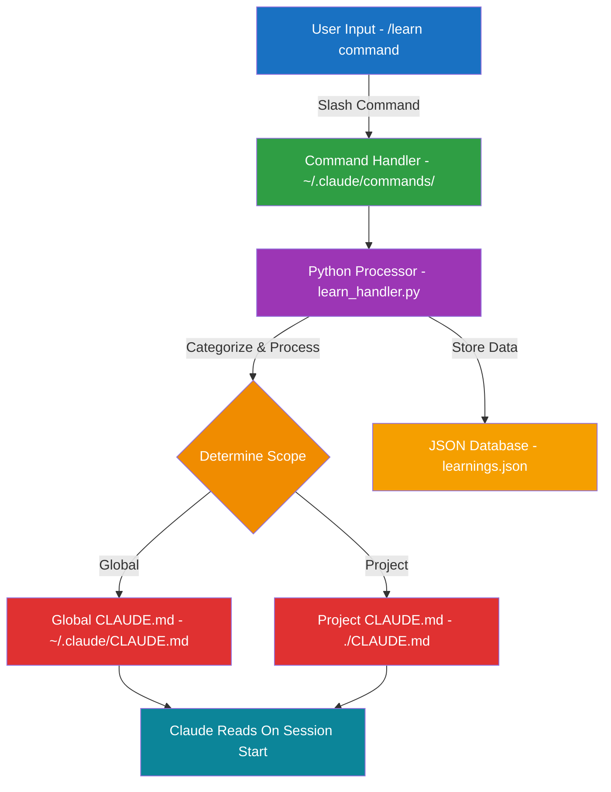
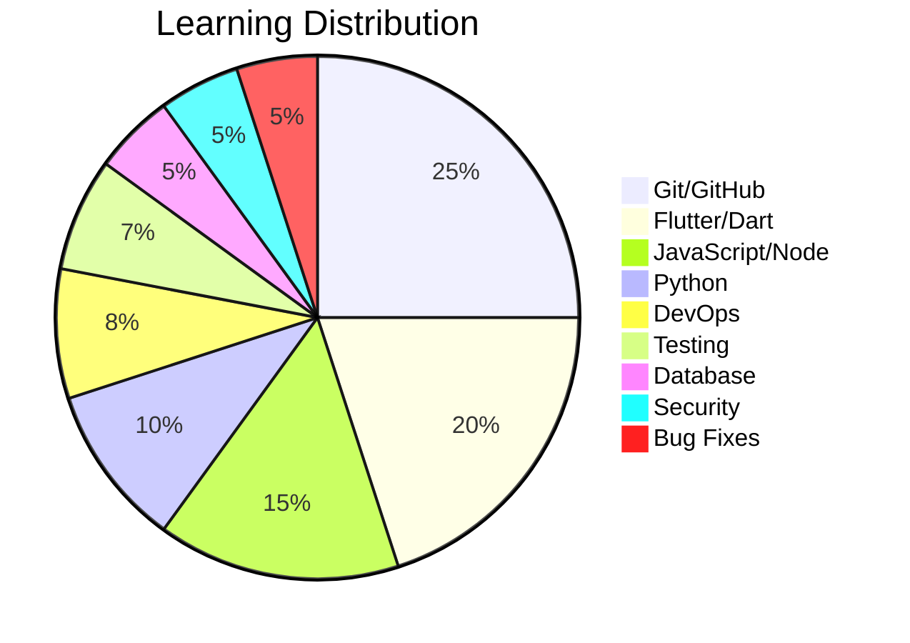

# 🧠 Claude Learning System

A persistent memory system for Claude Code that helps it remember corrections and avoid repeating mistakes across conversations.


### 🚀 Install in seconds:
```bash
curl -sSL https://raw.githubusercontent.com/amilovidov/claude-learning-system/main/install.sh | bash
```

## 🌟 Features

- **Persistent Memory**: Teach Claude once, it remembers forever
- **Mistake Prevention**: Claude learns from corrections to avoid repeating errors
- **Smart Categorization**: Automatically categorizes learnings (Git/GitHub, Flutter, Python, etc.)
- **Project & Global Scope**: Maintains both project-specific and global knowledge
- **Slash Commands**: Natural `/learn` interface to correct Claude's mistakes
- **Pattern Analysis**: Track Claude's common error patterns
- **JSON Database**: Structured storage for advanced queries

## 📊 How It Works



The learning flow is simple:
1. **Teach** - Use `/learn` to teach Claude something new
2. **Process** - System categorizes and determines scope  
3. **Store** - Saves to CLAUDE.md and JSON database
4. **Apply** - Claude reads learnings at next session start


## 🚀 Quick Start

### Installation

```bash
curl -sSL https://raw.githubusercontent.com/amilovidov/claude-learning-system/main/install.sh | bash
```

That's it! The installer will set up everything automatically.

### Update

To update to the latest version:

```bash
curl -sSL https://raw.githubusercontent.com/amilovidov/claude-learning-system/main/update.sh | bash
```

### Uninstall

To remove the system (your learnings will be backed up):

```bash
curl -sSL https://raw.githubusercontent.com/amilovidov/claude-learning-system/main/uninstall.sh | bash
```

### Alternative: Manual Installation

If you prefer to review the code first:

```bash
# Clone and inspect the repository
git clone https://github.com/amilovidov/claude-learning-system.git
cd claude-learning-system

# Review the scripts
cat install.sh

# Run the installer
./install.sh
```

## 📚 Usage

### Correcting Claude's Mistakes

When Claude makes an error, teach it the correct way:

```bash
/learn gh pr diff does not have --stat flag, use --name-only instead
```

### Viewing Learnings

```bash
# Show last 10 learnings
/learnings

# Show learnings about specific topic
/learnings github

# Show last N learnings
/learnings 5
```

### Recording Fixes

When Claude repeats an error, record the fix:

```bash
/fix Use flutter analyze before committing code
```

### Analyzing Claude's Error Patterns

See what mistakes Claude commonly makes:

```bash
/mistakes
```

## 📂 Learning Categories

The system automatically categorizes your learnings:



## 🛠️ How It Works

The system consists of:

1. **CLAUDE.md Files**: Markdown files that Claude reads at the start of each session
   - `~/.claude/CLAUDE.md` - Global learnings
   - `./CLAUDE.md` - Project-specific learnings

2. **Slash Commands**: Natural interface for teaching
   - `/learn` - Add new knowledge
   - `/learnings` - View past learnings
   - `/fix` - Record corrections
   - `/mistakes` - Analyze patterns

3. **Smart Categorization**: Automatically categorizes learnings:
   - Git/GitHub
   - Flutter/Dart
   - JavaScript/Node
   - Python
   - DevOps
   - Bug Fixes
   - General

4. **JSON Database**: Structured storage at `~/.claude/learnings.json`

## 📁 Project Structure

```
claude-learning-system/
├── install.sh                 # Main installer script
├── commands/                  # Slash command definitions
│   ├── learn.md              # /learn command
│   ├── learnings.md          # /learnings command
│   ├── fix.md                # /fix command
│   └── mistakes.md           # /mistakes command
├── handlers/                  # Command handlers
│   └── learn_handler.py      # Python learning processor
├── examples/                  # Example learnings
│   ├── github.md             # GitHub/Git examples
│   ├── flutter.md            # Flutter/Dart examples
│   └── general.md            # General examples
└── docs/                     # Documentation
    ├── ARCHITECTURE.md       # System architecture
    └── CONTRIBUTING.md       # Contribution guide
```

## 🎯 Examples

### Teaching GitHub Commands

```bash
/learn gh pr create uses --body not --description for PR body
/learn gh api is preferred over web fetching for GitHub data
/learn Always use gh pr diff --name-only to see changed files
```

### Teaching Flutter Best Practices

```bash
/learn In Flutter, always dispose timers in dispose() method
/learn flutter analyze should be run on specific files, not entire project
/learn Never use fvm, use system Flutter instead
```

### Recording Fixes

```bash
/fix Timer should be nullified after cancel() to prevent memory leaks
/fix Use ref.watch in build methods, ref.read in callbacks
```

## 🔧 Advanced Usage

### Backup Your Learnings

```bash
cp ~/.claude/CLAUDE.md ~/claude-learnings-backup.md
cp ~/.claude/learnings.json ~/learnings-backup.json
```

### Export Learnings as JSON

```bash
cat ~/.claude/learnings.json | jq '.learnings'
```

### Filter by Category

```bash
grep "**Git/GitHub**:" ~/.claude/CLAUDE.md
```

## 🤝 Contributing

Contributions are welcome! Please feel free to submit a Pull Request. See [CONTRIBUTING.md](docs/CONTRIBUTING.md) for details.

## 📝 License

This project is licensed under the MIT License - see the [LICENSE](LICENSE) file for details.

## 🙏 Acknowledgments

- Built for [Claude Code](https://claude.ai/code) by Anthropic
- Inspired by the need for persistent learning across Claude sessions
- Community feedback and contributions

## 🐛 Troubleshooting

### Commands Not Working

1. Ensure you're using Claude Code (not regular Claude)
2. Check that files exist in `~/.claude/commands/`
3. Verify Python 3 is installed: `python3 --version`

### Learnings Not Persisting

1. Check CLAUDE.md exists: `ls ~/.claude/CLAUDE.md`
2. Verify file permissions: `ls -la ~/.claude/`
3. Ensure Claude Code has file system access

## 📊 Stats

Track your learning progress:

```bash
# Total learnings
grep -c "^- \[" ~/.claude/CLAUDE.md

# Learnings by category
for cat in Git Flutter Python; do
  echo "$cat: $(grep -c "\*\*$cat" ~/.claude/CLAUDE.md)"
done
```

## 🚦 Roadmap

- [ ] Web dashboard for viewing learnings
- [ ] Export to various formats (PDF, HTML)
- [ ] Team sharing capabilities
- [ ] Learning synchronization across machines
- [ ] Integration with other AI assistants

## 💬 Support

- [Open an Issue](https://github.com/amilovidov/claude-learning-system/issues)
- [Discussions](https://github.com/amilovidov/claude-learning-system/discussions)

---

**Made with ❤️ for the Claude Code community**